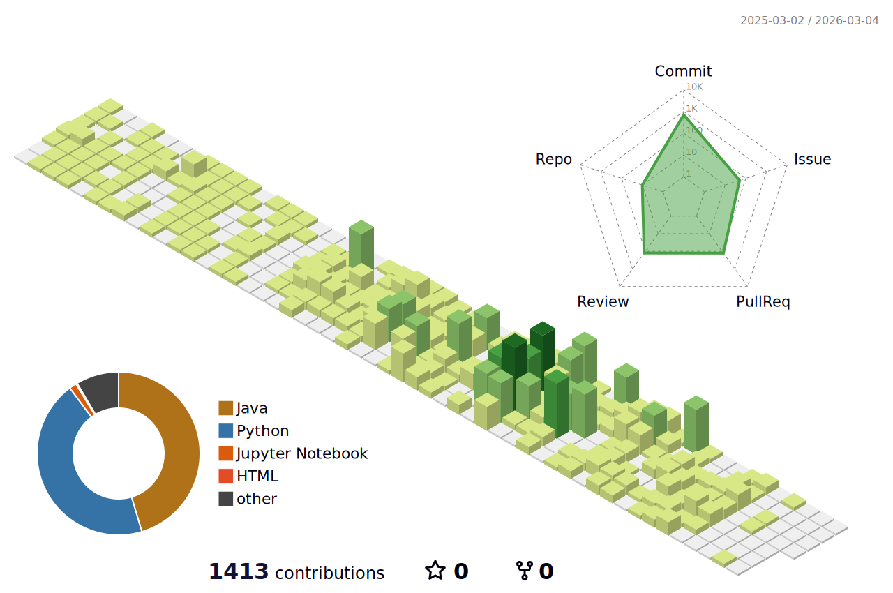

<h2 align="center">🙋‍♀️ Authenticated Developer, Eunjin</h2>

  안정적이고 확장 가능한 백엔드 서비스를 구현하며, 
  데이터를 안전하게 관리하고, 성능을 최적화하는 개발을 지향합니다.

---

### 🛠 Tech Stack

  
  
  
  
  
  
  

---

### 📚 Projects & Research
- **AI & Big Data Cybersecurity Orchestration**
- **QR Code Security Enhancement** 
- **Vulnerability Matching System** 
---

### 💡 Learning & Focus
- **Backend Development:** Java, Spring Boot, JPA  
- **Database Management:** SQL 
- **Infrastructure & Deployment:** Docker, CI/CD, AWS

---

### 🌐 Links

  
  

---

### 📊 GitHub Stats

  

---

